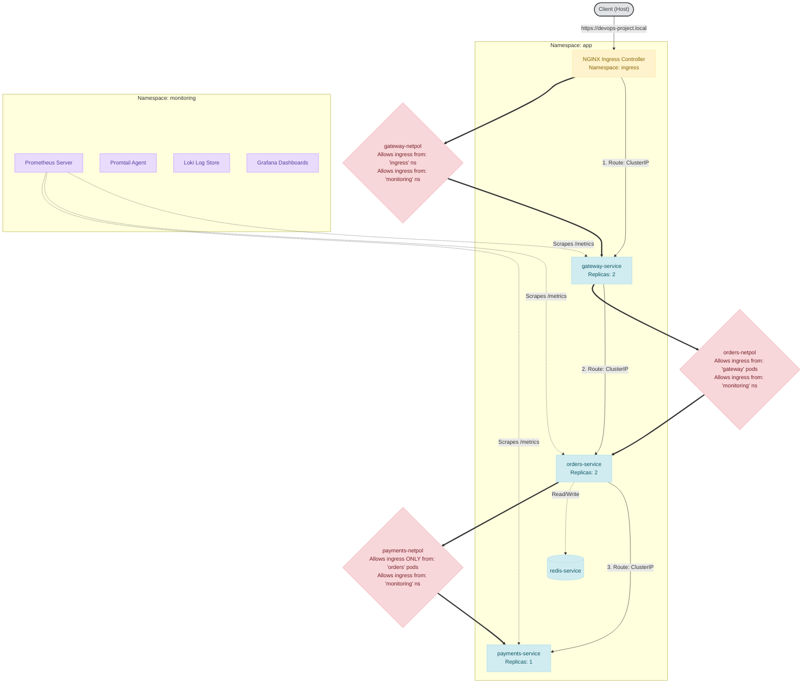

# Multi-Service Observability & Deployment Platform on Kubernetes

This repository implements a multi-service Python (FastAPI) application deployed on a local multi-node `kind` Kubernetes cluster. It features namespace segmentation, a CNI (Calico) that enforces strict NetworkPolicies, TLS termination via NGINX Ingress, and a full observability stack (Prometheus, Grafana, Alertmanager, Loki, Promtail) provisioned automatically using Terraform.

---

## Architecture & Request Path Flow

### Request Path & NetworkPolicy Flow



### Hop-by-Hop Traffic Enforcement

1.  **Client → NGINX Ingress Controller**:
    *   Traffic enters via host ports `80` (redirected) and `443`.
    *   NGINX terminates TLS using a self-signed certificate for `devops-project.local` generated dynamically by Terraform.
2.  **NGINX Ingress → `gateway`**:
    *   Allowed by **`gateway-netpol`**: Restricts ingress to pods residing in the `ingress` namespace (labeled `kubernetes.io/metadata.name: ingress`) and the `monitoring` namespace (for metric scraping).
3.  **`gateway` → `orders`**:
    *   Allowed by **`orders-netpol`**: Restricts ingress to pods labeled `app: gateway` and the `monitoring` namespace.
4.  **`orders` → `payments`**:
    *   Allowed by **`payments-netpol`**: Restricts ingress **only** to pods labeled `app: orders` and the `monitoring` namespace. 
    *   *Direct access from `gateway` or other pods to `payments` is blocked at the CNI level by Calico.*

---

## One-Command Bootstrap

To provision the entire platform (Kind cluster, build and load Docker images, run Terraform, deploy namespaces, Calico CNI, Helm charts, and microservice manifests), run this command in a PowerShell terminal:

```powershell
powershell -ExecutionPolicy Bypass -File ./scripts/bootstrap.ps1
```

> [!IMPORTANT]
> **Prerequisites:** Docker Desktop must be running. You may need to run PowerShell as **Administrator** because Kind binds host ports `80` and `443` to expose the NGINX Ingress controller.

### Local Host Setup
To access the services using host-based routing, map `devops-project.local` to localhost by adding the following line to your `C:\Windows\System32\drivers\etc\hosts` file:
```text
127.0.0.1 devops-project.local
```

---

## Observability & Alerting Stack

*   **Prometheus**: Scrapes `/metrics` from all 3 services. Relabeling in `ServiceMonitor` automatically injects a `service` label (e.g. `service="payments"`) to align with alerting rules.
*   **Alertmanager**: Routes alerts based on severity. It includes an **inhibition rule** which silences downstream `GatewayHighLatency` alerts when the root-cause `PaymentsHighErrorRate` is firing.
*   **Loki & Promtail**: Promtail ships pod logs to Loki. Promtail is configured with a JSON parsing pipeline that extracts `level`, `service`, and `request_id` from structured application logs, promoting them to queryable Loki index labels.
*   **Grafana**: Pre-wired with Prometheus and Loki data sources to visualize metrics and query logs.

---

## Incident Walkthrough

This walkthrough demonstrates a complete operability loop: detecting a fault, routing the alert, and tracing it through metrics and logs.

### Step 1: Verify Normal Operation
Send a request to the gateway. The gateway will propagate the request to orders, which registers it in Redis, charges the payment via payments, and returns success:
```powershell
curl -k https://devops-project.local/order
```
*Expected Response:* `{"status":"success", "order_id":"...", "order_count":1, "payment":{"status":"success", ...}}`

### Step 2: Inject Fault
Inject a failure into the payments service:
```powershell
powershell -ExecutionPolicy Bypass -File ./scripts/inject-fault.ps1
```
This sends a request to the payments container to toggle its in-memory `fault_active` state to `True`. Because `payments` is pinned to a single replica, 100% of payment attempts will now fail with HTTP 500.

### Step 3: Generate Failed Traffic
Send several requests to trigger the alert threshold:
```powershell
for ($i=1; $i -le 15; $i++) { curl -k https://devops-project.local/order; Start-Sleep -Milliseconds 200 }
```

### Step 4: Trace the Fault in Grafana and Loki
1.  **Alertmanager Fires**:
    *   The `PaymentsHighErrorRate` alert transitions to `FIRING` status because `payments` error rate exceeds 5% over 30s.
    *   The inhibition rule silences any warning alerts for `GatewayHighLatency` to prevent redundant notifications.
2.  **Metrics Spikes**:
    *   Grafana dashboards show a spike in HTTP 500 errors for `payments` and a corresponding latency/error surge on the `gateway` dashboard.
3.  **Logs Investigation**:
    *   Inspect the failed request headers to find the `X-Request-ID` returned in the client response.
    *   Search Loki logs in Grafana: `{service="gateway"} | json | request_id="<X-Request-ID>"` to see the incoming entry log.
    *   Correlate by querying all services with that request ID: `{request_id="<X-Request-ID>"}`.
    *   The log trace will clearly show the path:
        1.  `gateway` received request and forwarded to `orders`.
        2.  `orders` incremented count and forwarded to `payments`.
        3.  `payments` logged `Fault active: deliberately failing charge` and returned 500.
        4.  `orders` logged `Payment authorization failed` and returned failure.

### Step 5: NetworkPolicy Enforcement Proof
Verify that NetworkPolicies are properly blocking direct access:
```powershell
powershell -ExecutionPolicy Bypass -File ./scripts/test-network-policies.ps1
```
*   `gateway` can connect to `orders` (Success).
*   `orders` can connect to `payments` (Success).
*   `gateway` cannot connect to `payments` (Request times out due to Calico blocking direct traffic) (Success).

### Step 6: Recovery
Recover the payments service back to normal:
```powershell
powershell -ExecutionPolicy Bypass -File ./scripts/inject-fault.ps1 -Recover
```
The alert will resolve, and subsequent orders will succeed.

---

## Limitations & Production Considerations

> [!NOTE]
> This repository acts as a local validation, testing, and demonstration platform. It is not designed to be deployed directly to production in its current state.

### Current Sandbox Architecture Limits
- **Single-Host Kind Cluster**: Runs on a single physical host, offering no physical node redundancy or network partition tolerance.
- **Single Replicas**: Prometheus, Alertmanager, Loki, and Redis are deployed as single replicas with no high-availability (HA) configuration.
- **Non-Durable Storage**: Employs local `hostPath` PV/PVC configurations. Data does not persist across cluster deletions.
- **No PodDisruptionBudgets (PDBs)**: Pods can be evicted concurrently during cluster upgrades, causing service interruption.
- **Failover / Scheduling**: Multi-node cluster failover and scheduling constraints (node anti-affinity, tolerations) are not actively exercised or validated.

### Requirements for a Production-Grade Deployment
- **Managed Kubernetes Cluster**: Relocate from local Kind to GKE, EKS, or AKS, spanning multiple Availability Zones (AZs).
- **High-Availability Prometheus**: Set up Prometheus in an HA agent pair using Thanos, Cortex, or Grafana Mimir to manage global, long-term metric storage and deduplication.
- **Clustered Alertmanager**: Deploy Alertmanager in clustered mode with mesh networking to prevent single points of failure in alerting paths.
- **Enterprise Storage for Logs**: Configure Grafana Loki to run in microservices/simple-scalable mode with read/write separation, backed by durable object storage (AWS S3, Google Cloud Storage) instead of local filesystems.
- **Durable Cache & Store**: Upgrade Redis to an HA cluster/Sentinel configuration with managed lifecycle policies.
- **Scheduling & Disruption Policies**: Add PodDisruptionBudgets (PDBs) and pod anti-affinity rules to distribute service replicas across nodes and zones.
- **Simulated Load Testing**: Conduct synthetic traffic load and spike testing to set proper request/limit values, sizing calculations, and actual latency Service Level Objectives (SLOs).
